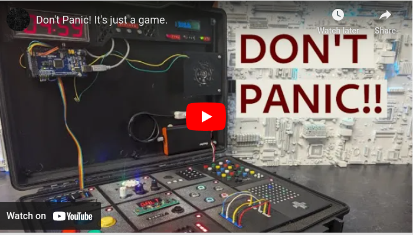

# Don't Panic! It's Just a Game

It’s an escape room in a box. A co-op puzzle game I made to infuriate my friends.

This project is an arduino-based, real-world version of the video game "Keep Talking and Nobody Explodes".

The video above details the game play and brief technical details about my Keep Talking and Nobody Explodes clone. You’ll want to watch that first. 

A detailed technical writeup (with pictures!) can be found at [https://heathbar.github.io/keep-talking](https://heathbar.github.io/keep-talking).